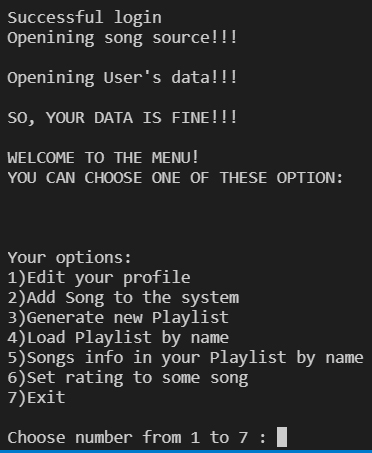
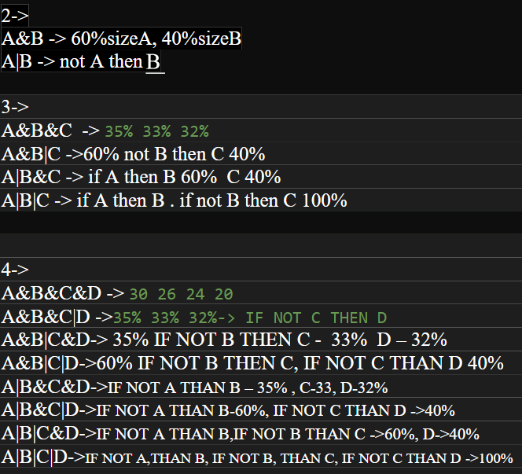

Описание на Музикалната колекция
================================

##### [Линк към сорса](https://github.com/nikizhelqzkov/Music_Collection)

Описание на конзолния интерфейс
-------------------------------

Конзолата се стартира и те пита дали желаеш да се Логнеш или
Регистрираш. При логин ти иска username и password. При регистрация
системата иска username, password, Full name, Дата на раждане и любими
жанрове музика.

След логин или регистър се стартира меню, в което имаш 7 избора:

-   Редактиране на данни в профила
-   Добавяне на песен към системата
-   Генериране на плейлиста по критерии
-   Зареждане на плейлиста по име
-   Информация на песните от плейлиста по име
-   Задаване на рейтинг за някоя песен
-   Изход

### Редактиране на данните на профила

Редактират се данните от класа USER.

### Добавяне на песен към системата

Попълваш исканите данни за песента и тя се добавя в системата.

### Генериране на плейлиста по критерии

Системата създава плейлиста по зададен размер на плейлиста(до 20 песни),
брой критерии и комбинации от логически операции с избраните критерии.

### Зареждане на плейлиста по име

Написваш името на валидна твоя плейлиста и си избираш песен от нея.

### Информация на песните от плейлиста по име

Написваш името на валидна твоя плейлиста и получаваш информация за
всички песни в плейлистата.

### Задаване на рейтинг за някоя песен

Задаваш рейтинг на валидна песен, но имаш право само на 1 гласуване за
нея.

### Изход

Системата спира.

Съхранение на данни
-------------------

Всички данни се пазят във файлове с txt формат. Всеки потребител му се
създава файл с данните, който се казва така, както му се казва
потребителското име. При промяна на потребителското име, файла се
изтрива и се създава нов файл с новото име и старите данни.

Файла с всички песни се казва Songs.txt и в него освен песните се пазят:
рейтинг на самата песен, кой е гласувал за нея вече(за да не може да
гласува отново) и всички рейтинги на всеки потребител. В него най-отпред
стои числото, което показва колко песни има в системата.

Използваните структури
----------------------

Всеки клас има различни използвани структури, но на първо място по
ползваемост като контейнер е Вектора.

Най-често във вектора се ползва Типа SONG.

В генератора на плейлисти са използвани и други структури: опашка за
последователно четене на критерии, опашка за последователно четене на
логически операциио и map за защита против повтаряне на критерии в
изискванията на потребителя.

Има и други използвани типове чрез вектор. Причината за използвана не
вектор е това, че е лесен за обхождане, благодарение на своя итератор и
операциите за достъпване на елемент.

Основни алгоритми в Музикалната колекция
----------------------------------------

### Login проверката и проверка за съществуващ профил при регистрация

При въведени данни в зона Логин, системата търси файл с име, което е
същото като това от въведения username + .txt. Ако има такъв файл, се
отваря и се проверява дали паролата е същата като тази от
потребителските данни на вход. Ако и двете проверки минат, се отваря
файла с потребителските му данни и системата отваря меню, чрез което
потребителя да работи в системата. При грешни данни потребителя бива
върнат към началото на програмата.

Ако потребителя се регистрира, системата проверява дали съществува
такова потребителско име. Ако съществува, тогава системата желае от
потребителя да въведе ново такова. При успешна регистрация, се създава
файл, в който му се пазят всички данни.

### Работа с файловете на всеки потребител и на песните

Данните се записват на един ред с цел Минифициране и трудно четене на
данни директно от самия файл. Всеки статус се отделя от друг с ';'. За
четене от файл се ползва seekg с точна бройка, къде да се поставя
пойнтъра и също се ползва getline до прочитане на ';', за безпроблемно
извличане на инфрормация от файла и лесно предаване на данните към
класовете.

### Редактиране на данни на потребител

Файла на потребителя е отворен, и всички негови данни са в класа USER.
Когато трябва да се променят данни като парола, любими жанрове, дата на
раждане и т.н, тогава се променят данните в класа и се поставя новата
информация във файла на потребителя. Ако се редактира потребителското
име, тогава се сменя файла(стария се изтрива и се създава нов с новото
име), с помощта на файловите потоци, а стария файл се изтрива с помощта
на std::remove

### Добавяне на песен в системата

След като се попълнят исканите данни за песента, се създава обект Песен,
който се пушка във вектора от песни и се отпечатва новата информация във
файла с песните.

### Генериране на плейлиста

Първо вземаме от потребителя желаната бройка песни в плейлистата.

Потребителя избира колко от четирите критерия да използва. Ако има повече
от 1 критерий, тогава освен номер на критерий избира и логическа
операция(& или |).

За да няма повтаряне на критерии, четирите критерия се пазят в мап с ключ
номер от 1 до 4 и стойност 0 или 1 и не се разрешава добавяне на
критерии, чиито ключ има стойност равна на 1.

Критериите се записват по ред и приоритет, като всеки по-ранен имам
повече проценти възможност за добавяне на песни спрямо изискваната
големина на плейлистата. За пазене на приоритет, данните се вкарват в
опашка от номера критерии и също така се добавят в друга опашка
логическите операции.

Извличат се данните от опашките и се вземат от токенизатор, който
разбира кой критерий да използва. Също така според броя искани критерии
и логическите операции има 15 варианта на добавяне на песни, като след
като се вземат песните от даден критерий, се сортират и чак тогава се
добавят.

Ето снимка на идеята за повече от 1 критерий:

След като си е добавило песните, системата известява колко песни е
добавила от всеки критерий.

Ако не е добавило никакви песни, защото критериите не са намерили
подходящи песни, тогава системата връща потребителя в основното меню.

Ако е намерило поне 1 песен, тогава потребителя трябвада си избере име
на плейлистата и след това се създава класа Playlist и се добавя към
класа User, и се печата във файла на потребителя.

Повече информация има в DOXYGEN документацията
----------------------------------------------
